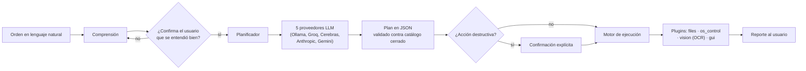

# Sunny — asistente RPA determinista local

Asistente que convierte órdenes en lenguaje natural en acciones reales sobre el sistema operativo, sin que el modelo de lenguaje controle el equipo en ningún momento.

## El problema

Dar a un modelo de lenguaje la capacidad de actuar sobre un ordenador real (abrir archivos, mover el ratón, leer la pantalla) tiene un riesgo evidente: si el modelo alucina — cree que ha entendido algo que no es correcto, o "ve" en la pantalla algo que no está — esa alucinación se convierte en una acción real sobre el sistema del usuario. El diseño de Sunny parte de esa premisa: el modelo nunca ejecuta nada directamente.

## Arquitectura

El ciclo de trabajo es fijo: comprende la orden → confirma esa comprensión con el usuario → planifica una secuencia de acciones → valida el plan contra un catálogo cerrado → pide confirmación explícita si alguna acción es destructiva → ejecuta → reporta el resultado. El LLM solo participa en las fases de comprensión y planificación, y su salida es JSON validado (Pydantic) contra un catálogo cerrado de acciones — nunca código ni comandos libres.

Decisiones de diseño relevantes:

- **Lectura de pantalla por OCR real, no por modelo de visión.** Un modelo de visión puede describir texto que no está presente en la imagen; un motor OCR determinista, no. La decisión prioriza la fiabilidad sobre la flexibilidad.
- **Cinco proveedores de modelo tras una interfaz común** (Ollama local, Groq, Cerebras, Anthropic, Gemini), con una cadena de fallback que distingue errores transitorios (reintentar con el mismo proveedor o pasar al siguiente) de errores definitivos (detener el ciclo y reportar, no reintentar indefinidamente).
- **Doble confirmación**: una para la comprensión de la orden, independiente de otra para la ejecución de acciones marcadas como destructivas.
- **Persistencia de sesión**: un REPL con memoria de sesión (SQLite) que mantiene contexto entre turnos, más logging estructurado en JSONL con rotación diaria y por tamaño.

## Resultados verificados

| Métrica | Valor |
|---|---|
| Líneas de código de producto | ~6.300 |
| Líneas de código de test | ~9.500 |
| Suite de tests ejecutable y verificada | 622 en verde |
| Proveedores LLM integrados tras interfaz común | 5 |
| Acciones funcionales disponibles en los plugins | 38 |

## La dificultad técnica superada

Al verificar el flujo de doble confirmación en el entorno real de destino (Bash sobre Windows) apareció un caso no documentado: `sys.stdin.isatty()` puede devolver `True` mientras `sys.stdout.isatty()` devuelve `False` en ese mismo entorno, simultáneamente. Un control que comprueba únicamente `stdin` para decidir si puede pedir confirmación por teclado da un falso positivo — cree que hay un terminal interactivo disponible y se queda colgado esperando una entrada que nunca llega por ese canal, en lo que debería ser un proceso automatizado sin supervisión.

La corrección fue exigir el AND de ambos (`stdin.isatty() and stdout.isatty()`) antes de asumir que existe un terminal interactivo real. Es el tipo de fallo que solo aparece al probar contra la plataforma de destino real, no al asumir que el comportamiento de una API estándar de Python es uniforme entre sistemas.

## Estado honesto

- **Funciona y está probado**: CLI en modo `one-shot` y en modo REPL persistente, ciclo completo de comprensión-planificación-validación-ejecución-reporte, doble confirmación, lectura de pantalla por OCR, cadena de fallback entre los 5 proveedores de modelo.
- **Cifra de tests verificada, no declarada.** El proyecto es nativo de Windows: al ejecutar la suite en Linux, 622 casos pasan en verde y 15 fallan, todos por diferencias de plataforma (llamadas de sistema propias de Windows), sin un solo fallo de lógica. Se publica la cifra reproducida en ejecución.
- **`ai_bridge` (automatización de navegador) es un stub**: lanza `NotImplementedError` de forma explícita. No está implementado; queda pendiente de integrar automatización real de navegador (Playwright) con selectores concretos.
- **El bucle de percepción-planificación avanzada (`environment_loop`) está diseñado pero no integrado** en el flujo principal de ejecución. Es arquitectura preparada, no una capacidad operativa hoy.

## Stack

Python · Pydantic (validación de planes) · SQLite (memoria de sesión) · structlog (logging) · Ollama (modelo local) · Groq · Cerebras · Anthropic · Gemini · OCR para lectura de pantalla
